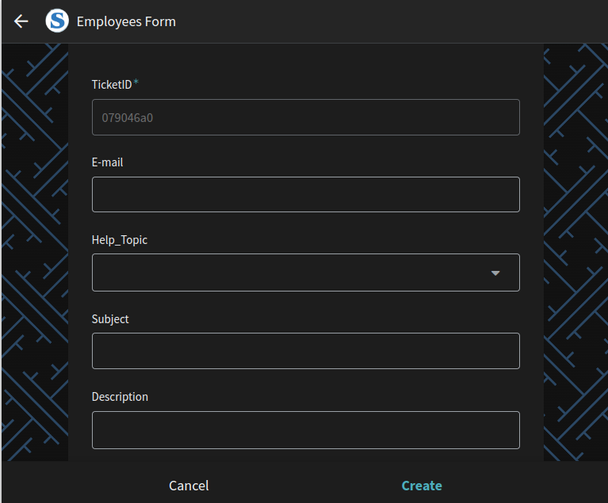
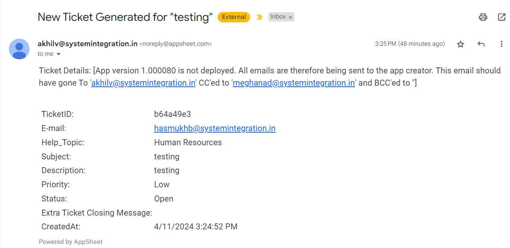

# Ticket Management System (TMS) 🎫
Welcome to the Ticket Management System (TMS)! This system is designed to streamline ticket creation, tracking, and management for organizations.

## Features 📌 

### User Management 
  - **Head Admin**:
    - Create, update, and delete users with email, name, and userType (Ticket admin, Head admin, or Employee).
  - **Ticket Admins (Human resources, Network and system administrator)**:
    - Different interfaces tailored to each admin's role.
    - Ability to view specific tickets based on their status (open/close).
    - Automatically send an email with a closing ticket message to the specific user when they close an employee's ticket.
   - **Employee**:   
     - Create tickets (id, Help topic, subject, description, priority, createdAt) for specific ticket admin.
     - Automatically send an email containing all ticket information to the specific ticket administrator based on the help topic.
     - Send an email notification to the ticket administrator when an employee reopens a ticket.

## Other Features 📔
- **Ticket Creation**:
  - Employees can easily create tickets with different subjects and descriptions.
  
   

- **Ticket Tracking**:
  - Track the status of tickets and receive automated notifications.

- **Admin Dashboard**:
  - Administrators have access to a dashboard to manage users, tickets, and system activities.

- **Email Notifications**:
  - Automated email notifications for ticket updates and closures.
  
  

## Getting Started 🚀   

To get started with the Ticket Management System, follow these steps:

1. **Installation**:
   - Access the Ticket Management System via the provided link.
   - Log in using your credentials provided by the admin.

2. **User Roles**:
   - Head Admin: Manage users and system settings.
   - Ticket Admin: Manage tickets and monitor system activities.
   - Employee: Create and track tickets.

3. **Ticket Creation**:
   - Employees can create tickets with necessary details.
   - Ticket Admins receive notifications and can manage tickets from their interface.

4. **Ticket Management**:
   - Admins can view, update, and close tickets as necessary.
   - Automated notifications are sent based on ticket status changes.

## Support ✅
For any issues or queries related to the Ticket Management System, please contact (info@systemintegration.in).

